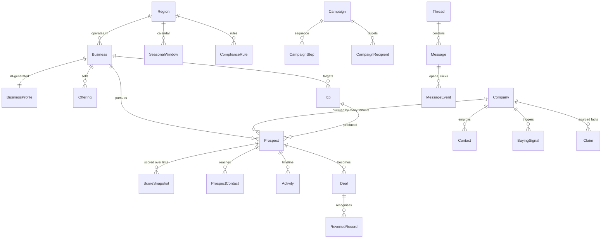

# Data model

The schema is [`prisma/schema.prisma`](../prisma/schema.prisma) — 41 models and enums,
validated. This document explains the parts that are not self-evident from reading it.

## The core shape

## Five things that are not obvious

### 1. `Company` is global; `Prospect` is the tenant's relationship with it

`Company` has no `businessId`. `Prospect` has the unique constraint
`@@unique([businessId, companyId])`. Research done for one tenant benefits all of them;
strategy, scoring and conversation stay private. This is the difference between a CRM and
a platform, and it is very hard to retrofit — hence day one.

### 2. `Claim` sits between research and truth

Research agents write `Claim` rows, not `Company` fields. A deterministic promoter decides
what becomes canonical, and only sourced claims are eligible. This is the anti-hallucination
spine described in [01-architecture.md §5](01-architecture.md). It also gives the UI
"where did this come from?" for free, and makes stale-data refresh a query
(`WHERE expiresAt < now()`) rather than a guess.

### 3. `ScoreSnapshot` stores the breakdown, not just the number

`Prospect.score` is a denormalised cache for sorting. The truth is the latest
`ScoreSnapshot`, which carries `factors` (every factor's raw value, weight, contribution
and evidence) and the `modelId` whose weights produced it. When the Performance Agent
refits weights into a new `ScoringModel` version, historical scores remain explainable
because their snapshot recorded the weights in force at the time.

### 4. `SendLedgerEntry` exists only to count

It is append-only, holds a **salted hash** of the recipient rather than an address, and is
indexed on `(businessId, contentGroupId, sentAt)` — the exact shape of the Spam Control
Act's rolling-window bulk test. Keeping it separate from `Message` means the legal counter
survives message deletion and never becomes a shadow contact database.
See [04-compliance.md §3](04-compliance.md).

### 5. `Region`, `SeasonalWindow` and `ComplianceRule` are why this isn't Singapore-only

Spec §21 requires the architecture to generalise. Nothing in the schema names Singapore:

- Markets are `Region` rows (`SG`, `AU`, `AU-NSW` via `parentId`).
- Chinese New Year, Hari Raya, Deepavali, Christmas are `SeasonalWindow` rows scoped to a
  region, each with `buyingLeadDays` — because the outreach moment is weeks *before* the
  event, and that lead time differs by occasion and industry.
- SG UEN, AU ABN, UK CRN coexist as `CompanyIdentifier.scheme` values.
- Statutory rules are `ComplianceRule` rows keyed by region and channel.

Adding Australia is a seed file and a legal review, not a migration.

## Seed data required before first run

| Table | Rows |
|---|---|
| `Region` | `SG` (Asia/Singapore, SGD, en-SG) |
| `SeasonalWindow` | SG: CNY, Valentine's, Hari Raya, Easter, Mother's/Father's Day, National Day, Deepavali, Christmas, New Year — each with `buyingLeadDays` and `relevantTo` industry tags |
| `ComplianceRule` | SG × EMAIL: bulk thresholds, `<ADV>` rule, unsubscribe requirement, with statute citations. SG × PHONE: `dnc_check_required = true` |
| `ScoringModel` | platform default v1, hand-set weights (there is no outcome data to fit from yet) |

Dated windows (CNY, Hari Raya, Deepavali, Easter) move each year — seed at least three
years forward and add a job that warns when the horizon is under 12 months.

## Indexing notes

The indexes in the schema target the queries the dashboard actually makes:
`(businessId, tier, score)` for the hot-leads panel, `(businessId, nextActionAt)` for
follow-ups due, `(companyId, expiresAt)` for live signals, `(businessId, status, priority)`
for the recommendation feed.

Add when volume justifies it, not before: a GIN index on `Company.description` for
keyword discovery, and `pg_trgm` on `Company.name` for fuzzy dedupe — entity resolution on
company names is a real problem ("ABC Holdings Pte Ltd" vs "ABC Holdings") and domain
matching only solves the easy half.
